# Storefront Cloud CLI


<a href="https://join.slack.com/t/vuestorefront/shared_invite/enQtMzA4MTM2NTE5NjM2LTI1M2RmOWIyOTk0MzFlMDU3YzJlYzcyYzNiNjUyZWJiMTZjZjc3MjRlYmE5ZWQ1YWRhNTQyM2ZjN2ZkMzZlNTg"></a>

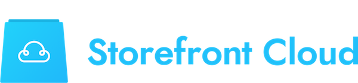

Storefront Cloud CLI is a command line management tool for <a href="https://storefrontcloud.io">Storefront Cloud</a>. Storefront Cloud is a <a href="https://github.com/DivanteLtd/vue-storefront">Vue Storefront</a> hosted solution brought to You by <a href="https://divante.co">Vue Storefront founding team</a>.

This tool allows You to manage the remote server cluster and perform all the management operations like:
 - Code Deployments (including Zero-downtime deployment scenarios),
 - Elastic Search dump/restore,
 - File operations,
 - Remote shell,
 - ...

 ## Official Docs

 Please visit the <a href="http://help.storefrontcloud.io">Official Storefront Cloud Docs</a> for details on how to use the cloud. You can find some example calls of this tool described below - as well :)

 ## Getting started

 In order to use this tool, please go to <a href="https://storefrontcloud.io">Storefront Cloud</a> and register Your account. You'll get the required **kubectl.config** file including all the certificates required for this tool to connect to Your instance.

 Typically, You're getting from Storefront Cloud team access to two Kubernetes **Namespaces** (two instances). For instance - let's take a look how the deployment of our <a href="https://demo.storefrontcloud.io">demo.storefrontcloud.io</a>. 

 There are **two namespaces**:

 - **demo-storefrontcloud-io** - which is the instance where the **prod** version of Your Vue Storefront app is deployed,
 - **demo-test-storefrontcloud-io** - which is the instance where the **test** versin of Your Vue Storefront app is deployed.

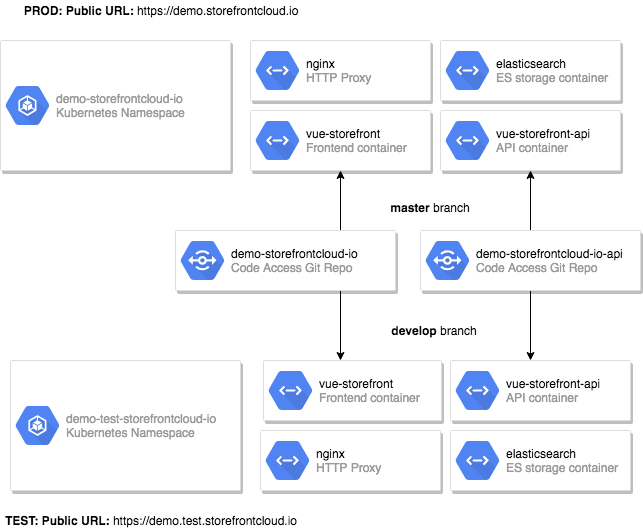

 Each namespaces includes **PODs** (POD is kind of Kubernetes app container):

 ```
┌─────────────────────────────────────────────┬──────────┬──────────┬─────────────────────────┐
│ POD name                                    │ Role     │ State    │ Start time              │
├─────────────────────────────────────────────┼──────────┼──────────┼─────────────────────────┤
│ elasticsearch-75cf68b6b7-thjsx              │ elastic  │ Running  │ 2018-10-12T11:36:05Z    │
├─────────────────────────────────────────────┼──────────┼──────────┼─────────────────────────┤
│ kibana-69777f68b-dd6s5                      │          │ Running  │ 2018-10-09T13:24:06Z    │
├─────────────────────────────────────────────┼──────────┼──────────┼─────────────────────────┤
│ nginx-6d68c9557-l67l2                       │ nginx    │ Running  │ 2018-10-09T13:24:02Z    │
├─────────────────────────────────────────────┼──────────┼──────────┼─────────────────────────┤
│ redis-84d7c989c9-5j4tq                      │ redis    │ Running  │ 2018-10-09T13:24:06Z    │
├─────────────────────────────────────────────┼──────────┼──────────┼─────────────────────────┤
│ vue-storefront-848799bd5d-zvcd4             │ front    │ Running  │ 2018-10-12T11:46:09Z    │
├─────────────────────────────────────────────┼──────────┼──────────┼─────────────────────────┤
│ vue-storefront-api-5c5dbc57fd-l9fhr         │ api      │ Running  │ 2018-10-12T14:14:37Z    │
└─────────────────────────────────────────────┴──────────┴──────────┴─────────────────────────┘
```

Together with the Kubernetes namespaces, Vue Storefront team is providing You with **git** access via <a href="https://code.vuestorefront.io">Storefront Cloud Code Access</a> site. You may find two repositories in there:

- <a href="https://code.storefrontcloud.io/Divante/demo-storefrontcloud-io">**demo-storefrontcloud-io**</a> - which **master** branch is used to deploy the production frontend and **develop** branch is used to deploy the test frontend,
- <a href="https://code.storefrontcloud.io/Divante/demo-storefrontcloud-io-api">**demo-storefrontcloud-io-api**</a> - which **master** branch is used to deploy the production API and **develop** branch is used to deploy the test API.

The namespaces are bound to the public URL addresses:

- <a href="https://code.storefrontcloud.io/Divante/demo-storefrontcloud-io">**demo-storefrontcloud-io**</a> is deployed under <a href="https://demo.storefrontcloud.io">demo.storefrontcloud.io</a>
- <a href="https://code.storefrontcloud.io/Divante/demo-storefrontcloud-io-api">**demo-storefrontcloud-io-api**</a> is deployed under <a href="https://demo.storefrontcloud.io/api">demo.storefrontcloud.io/api</a>


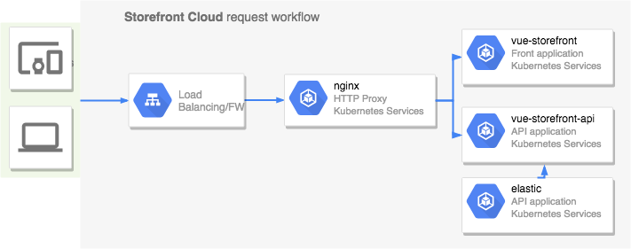

## Operations

**Storefront Cloud CLI** tool is designed to let You manage Your Storefront Cloud namespaces. Most of the operations are available for the user as a self service. In cases of any problems or custom needs <a href="https://help.storefrontcloud.io">please do contact the Helpdesk</a>

### Setup

Shortly after You register Your account on the <a href="https://storefrontcloud.io">storefrontcloud.io</a> You should receive a contact request from the Cloud Team. Then after agreeing on the service terms and conditions Cloud Team will provide You with:

- **kube.config** file that You can paste or import to this tool for getting access to Your Kubernetes cluster,
- **login and password** to the <a href="https://code.storefrontcloud.io">Storefront Cloud Code Access</a> portal.

The setup steps, getting access to Your cloud:

#### Install storefrontcloud-cli
First, install `storefrontcloud-cli` (requirements: `node 8.x+, yarn`):

```bash
git clone https://github.com/StorefrontCloud/storefrontcloud-cli.git`
cd storefrontcloud-cli
yarn install
```


#### Setup Your account:

Please do run:
`node scripts/cli.js setup`

1. The setup wizard will ask You first about the **kube.config** file. You can save the file received from the Cloud Team to Your local file system (for example: **~/.kube/config** which is the default path) OR You can use Your default system editor to paste the config content directly during the setup.

2. Then You have an option to use Your existing <a href="https://kubernetes.io/docs/tasks/tools/install-kubectl/">kubectl</a> tool. If You haven't used it before the setup will download and install the tool to the current working directory.

3. The last question is about the default namespace. Please check the architecture diagram above. In our case we're providing the **demo-storefrontcloud-io** default namespace. That means that all subsequent calls will be made to the public instance of **demo.storefrontcloud.io** PODs. You can switch the default namespace by using `node scripts/cli.js namespace` command OR using the `--ns command` which is supported by all cli commands.

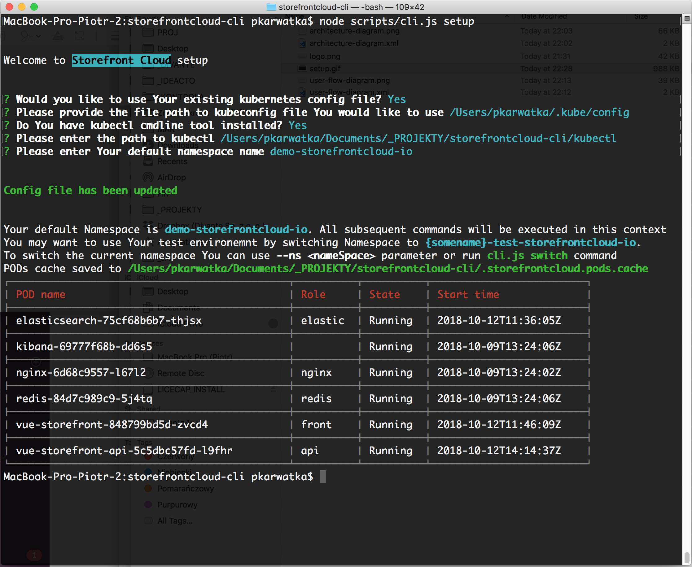

### Switch namespace

The **Kubernetes Namespace** implies the website You're accesing. By default You're getting two namespaces:

- **instance-storefrontcloud-io** - which is the main, public instance (accesible via **instance.storefrontcloud.io**),
- **instance-test-storefrontcloud-io** - which is the second development/test, instance (accesible via **instance.test.storefrontcloud.io**).

You may switch the instance any time by the following command:

```
node scripts/cli.js namespace
```
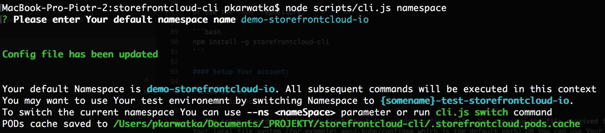

As You may observe, after setting the proper namespace `storefrontcloud-cli` is getting the available PODs and storing the PODs cache in the `.storefrontcloud.pods.cache` file.

**Important note:** You may call the commands within different namespaces even without changing the default namespace (`namespace` command). It's possible by just using the `--ns <namespace>` parameter, which is supported by all commands.

### List PODs

Your Storefront Cloud instance may consist of one or many [PODs](https://kubernetes.io/docs/concepts/workloads/pods/pod/). Pods are the smallest deployable units of computing that can be created and managed in Kubernetes.

A pod (as in a pod of whales or pea pod) is a group of one or more containers (such as Docker containers), with shared storage/network, and a specification for how to run the containers. A pod’s contents are always co-located and co-scheduled, and run in a shared context. A pod models an application-specific “logical host” - it contains one or more application containers which are relatively tightly coupled — in a pre-container world, being executed on the same physical or virtual machine would mean being executed on the same logical host.

In Vue Storefront Your instance is initialized with the following PODs (the names are automatically generated and are subject to change in Your Project):

```
┌─────────────────────────────────────────────┬──────────┬──────────┬─────────────────────────┐
│ POD name                                    │ Role     │ State    │ Start time              │
├─────────────────────────────────────────────┼──────────┼──────────┼─────────────────────────┤
│ elasticsearch-75cf68b6b7-thjsx              │ elastic  │ Running  │ 2018-10-12T11:36:05Z    │
├─────────────────────────────────────────────┼──────────┼──────────┼─────────────────────────┤
│ kibana-69777f68b-dd6s5                      │          │ Running  │ 2018-10-09T13:24:06Z    │
├─────────────────────────────────────────────┼──────────┼──────────┼─────────────────────────┤
│ nginx-6d68c9557-l67l2                       │ nginx    │ Running  │ 2018-10-09T13:24:02Z    │
├─────────────────────────────────────────────┼──────────┼──────────┼─────────────────────────┤
│ redis-84d7c989c9-5j4tq                      │ redis    │ Running  │ 2018-10-09T13:24:06Z    │
├─────────────────────────────────────────────┼──────────┼──────────┼─────────────────────────┤
│ vue-storefront-848799bd5d-zvcd4             │ front    │ Running  │ 2018-10-12T11:46:09Z    │
├─────────────────────────────────────────────┼──────────┼──────────┼─────────────────────────┤
│ vue-storefront-api-5c5dbc57fd-l9fhr         │ api      │ Running  │ 2018-10-12T14:14:37Z    │
└─────────────────────────────────────────────┴──────────┴──────────┴─────────────────────────┘
```

To list the available PODs in Your environment please run the following command:

```bash
node scripts/cli.js pods
```

You may run the subsequent `cli` calls using the selected POD context.

### Switch POD

To switch the current POD You should run:

```
node scripts/cli.js pod
```

This command will run the interactive UI to switch the POD:

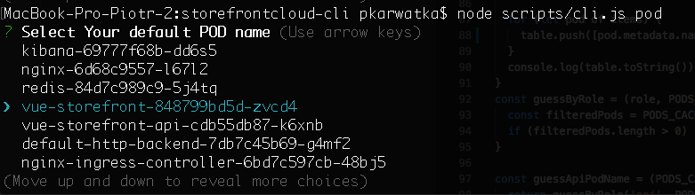

The other option, if You already know Your POD name is to run this command in the silent mode:

```
node scripts/cli.js pod --pod=vue-storefront-848799bd5d-zvcd4  
```

This will set the current POD to `vue-storefront-848799bd5d-zvcd4`.
**Note:** You may also switch the POD by the **role name**. The following command:

```
node scripts/cli.js pod --pod=front  
```

... will also set the current POD to `vue-storefront-848799bd5d-zvcd4`

The current POD along with the current Namespace name will be used to all subsequent `cli` calls setting the proper context. You may also use the `--pod=<podname>|<rolename>` to switch the POD ad-hoc.

### Deploy code to POD

Storefront Cloud PODs are configured to deploy the code in the initialization procedure. 
**Note:** Please note that Your code is available under [Storefront Cloud Code Access (Web+Git)](https://code.storefrontcloud.io) via credentials provided by the Cloud Team.

That being said - the deployment = restart the POD. Our Kubernetes configuration works with the zero-downtime configuration.

You may find two repositories in there:

- <a href="https://code.storefrontcloud.io/Divante/demo-storefrontcloud-io">**demo-storefrontcloud-io**</a> - which **master** branch is used to deploy the production frontend and **develop** branch is used to deploy the test frontend,
- <a href="https://code.storefrontcloud.io/Divante/demo-storefrontcloud-io-api">**demo-storefrontcloud-io-api**</a> - which **master** branch is used to deploy the production API and **develop** branch is used to deploy the test API.

The namespaces are bound to the public URL addresses:

- <a href="https://code.storefrontcloud.io/Divante/demo-storefrontcloud-io">**demo-storefrontcloud-io**</a> is deployed under <a href="https://demo.storefrontcloud.io">demo.storefrontcloud.io</a>
- <a href="https://code.storefrontcloud.io/Divante/demo-storefrontcloud-io-api">**demo-storefrontcloud-io-api**</a> is deployed under <a href="https://demo.storefrontcloud.io/api">demo.storefrontcloud.io/api</a>


To deploy the changes to **demo.storefrontcloud.io** You may run:

```
node scripts/cli.js deploy --pod=front
```

To deploy the changes to **demo.storefrontcloud.io/api** You may run:

```
node scripts/cli.js deploy --pod=api
```

This command is about to execute the following sequence of steps:
- create new instance of the selected role's container,
- run the initialization + deployment procedure,
- kill the old container whenever the new one is up and running,
- select the new container as the default one.

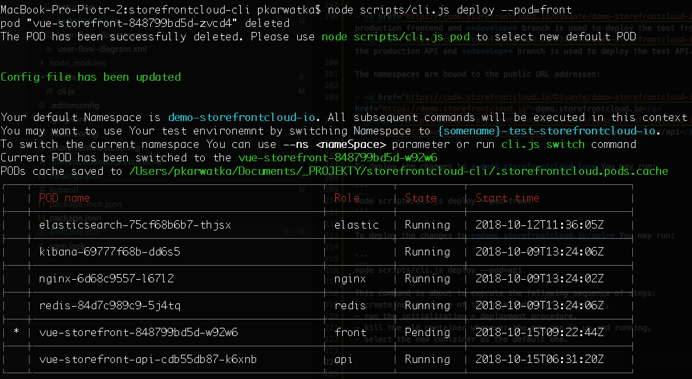

### Execute remote command

Storefront Cloud CLI tool allows You to execute the remote commands within the selected PODs:

```bash
node scripts/cli.js exec --pod=front -- ps
node scripts/cli.js exec --pod=api -- ps
```

**Note:** You may also use the exact POD name by the switches presented above. If no switch is used - then the default POD (selected by `cli.js pod`) and the default Namespace (selected by `cli.js namespace`) are being used.

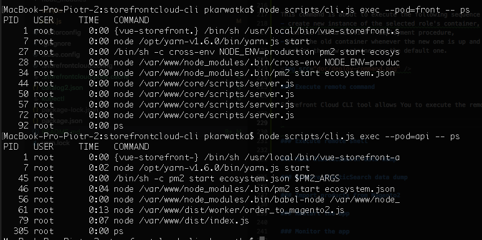

You may run the interactive commands as well:

```bash
node scripts/cli.js exec --pod=api -- yarn pm2 monit
```

**Note:** You can switch the namespace and/or POD name ad-hoc by using the `--ns=` and `--pod=` switches.

### Execute remote shell

To execute the remote shell please use the following command:

```
node scripts/cli.js exec --pod=api -- sh
```

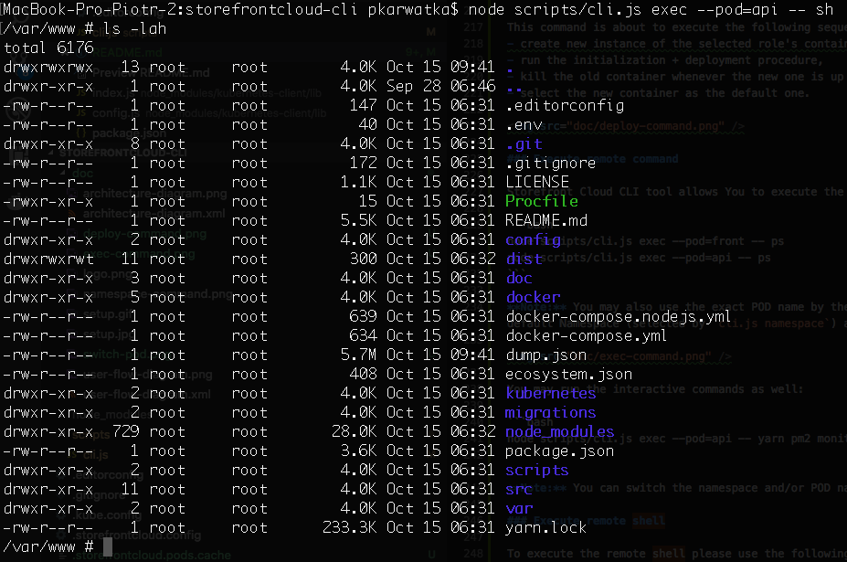

The `sh` shell will be used. 
**Important note:** Please note that the storage mounted to the container is volatile. That means that by each deployment it's being erased + deployed from the <a href="https://code.storefrontcloud.io">**Storefront Cloud Code Access**</a>

Please **DO NOT** modify any files directly.
To exit the shell please type `exit` or use `Ctrl+D`.

### Transfer files and directories between localhost and containers

To transfer files TO and FROM any POD in Your namespace please do use the following command:

```
node scripts/cli.js cp api:var/catalog.json catalog-copy.json
```

This command will copy the `var/catalog.json` file from the container with the role `api` to local file named `catalog-copy.json`. You can do the reverse operation (uploading the local file) with the following command:

```
node scripts/cli.js cp catalog-copy.json api:var/catalog.json 
```

**Note:** You may transfer the whole folders (both sides) with the same shell calls as presented above.

### Make ElasticSearch data dump

We are using the [elasticdump](https://www.npmjs.com/package/elasticdump) configured along with the `vue-storefront-api` container to perform the ElasticSearch data dumps. By default the index used in the `vue-storefront-api:config/local.json:elasticsearch.indices` us backed up. Typically it's `vue_storefront_catalog`.

The Storefront Cloud CLI by executing the ElasticSearch data dump will execute the following sequence of commands:

- use elasticdump to dump the data to the `var/catalog.json` on the server,
- transfer the file using `kubectl cp` to localhost.

The command:
```
node scripts/cli.js dump --output=catalog.json
```

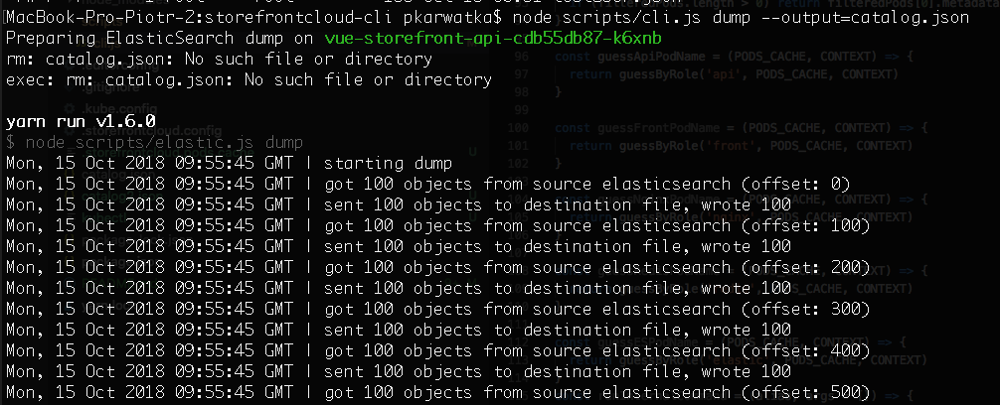

**Note:** The data dump command works only on the PODs with the `api` role. The command will try to guess the POD name until the `--pod=` switch will be used.

### Restore ElasticSearch data dump

To restore the data dumped with the `dump` command please run: 

```
node scripts/cli.js restore --input=catalog.json
```

The Storefront Cloud CLI by executing the ElasticSearch data restore will execute the following sequence of commands:

- transfer the file using `kubectl cp` to localhost,
- use elasticdump to restore the data to the `var/catalog.json` on the server,

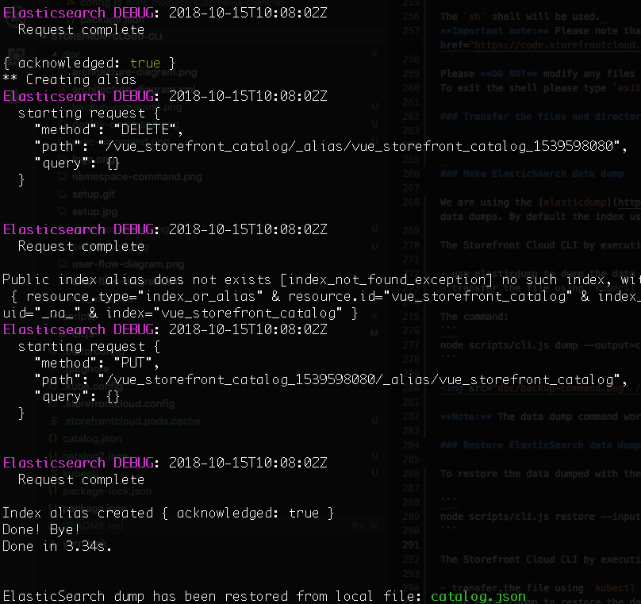

### Import products from Magento2

Since 1.5 release, Vue Storefront API contains the [`mage2vuestorefront`](https://github.com/DivanteLtd/mage2vuestorefront) data importer instance which can be used to import the data from Your Magento2 instance:

```
node scripts/cli.js import
```

**Please note:** Magento2 API credentials need to be set in the `vue-storefront-api/config/local.json` in Your repository. Please configure the access regarding the [following docs](https://github.com/DivanteLtd/vue-storefront/blob/docs/docs/guide/installation/magento.md) and push to Your [Storefront Cloud Code Access](https://code.storefrontcloud.io).

**Please note:** The mage2vuestorefront data bridge do support many other working modes (for example on-demand indexing). If You're interested in these, please do [contact the Cloud Team](https://help.storefrontcloud.io) to setup the details.

### Run the PM2 process manager

Storefront Cloud is using the [`pm2`](http://pm2.keymetrics.io/) process manager to run both: `vue-storefront` and `vue-storefront-api`.

You may use most of the standard PM2 features by running:

```
node scripts/cli.js pm2 --pod=front
```

or

```
node scripts/cli.js pm2 --pod=api
```


### Restart the app

Storefront Cloud is using the [`pm2`](http://pm2.keymetrics.io/) process manager to run both: `vue-storefront` and `vue-storefront-api`.
To restart the application You may run the following command:

```
node scripts/cli.js pm2 reload all --pod=front
node scripts/cli.js pm2 reload all --pod=api
```

or

```
node scripts/cli.js pm2 reload server --pod=front
node scripts/cli.js pm2 reload api --pod=api
```

**Please note:** PM2 process manager has been installed on the PODs with roles of `api` and `front`. You may run:
**Please note:** The PM2 process names are set to: `server` on the `front` POD and `api` on the `api` POD. Additionally there is the `o2m` PM2 handle running on the `api` PODs to transfer the orders between Vue Storefront and Magento2.

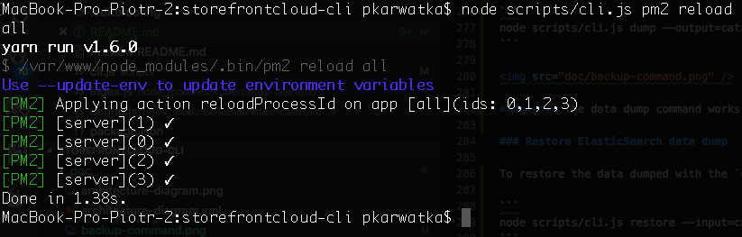

### Monitor the app

Storefront Cloud is using the [`pm2`](http://pm2.keymetrics.io/) process manager to run both: `vue-storefront` and `vue-storefront-api`.
Please take a look at the [PM2 monitoring features](http://pm2.keymetrics.io/docs/usage/monitoring/).

The following commands may be used to monitor the app:

```
node scripts/cli.js pm2 logs server --pod=front
node scripts/cli.js pm2 logs api --pod=api
```

To enter the interactive monitoring tool please use:

```
node scripts/cli.js pm2 monit server --pod=front
node scripts/cli.js pm2 monit api --pod=api
```

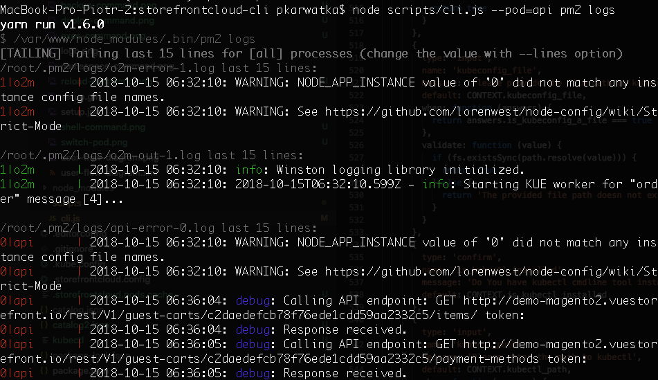
